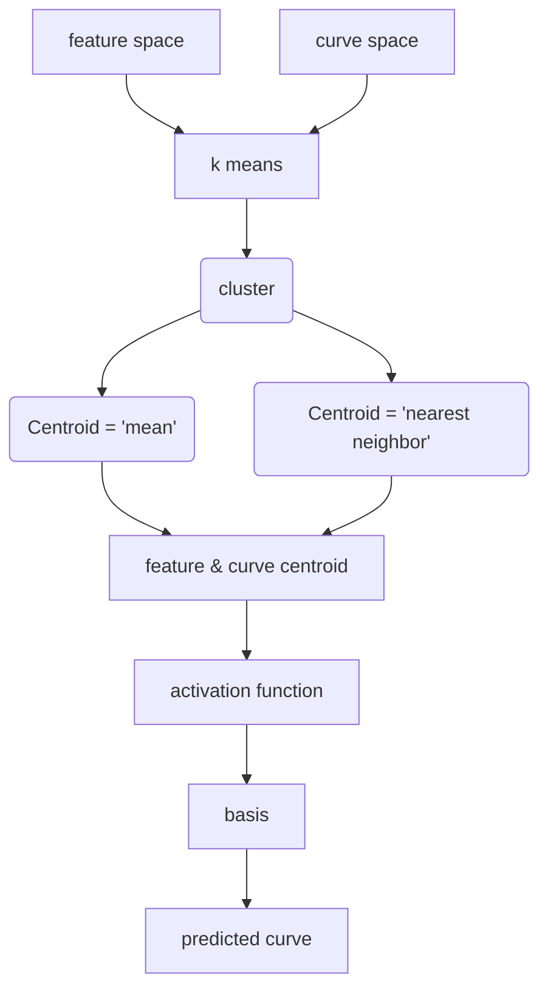
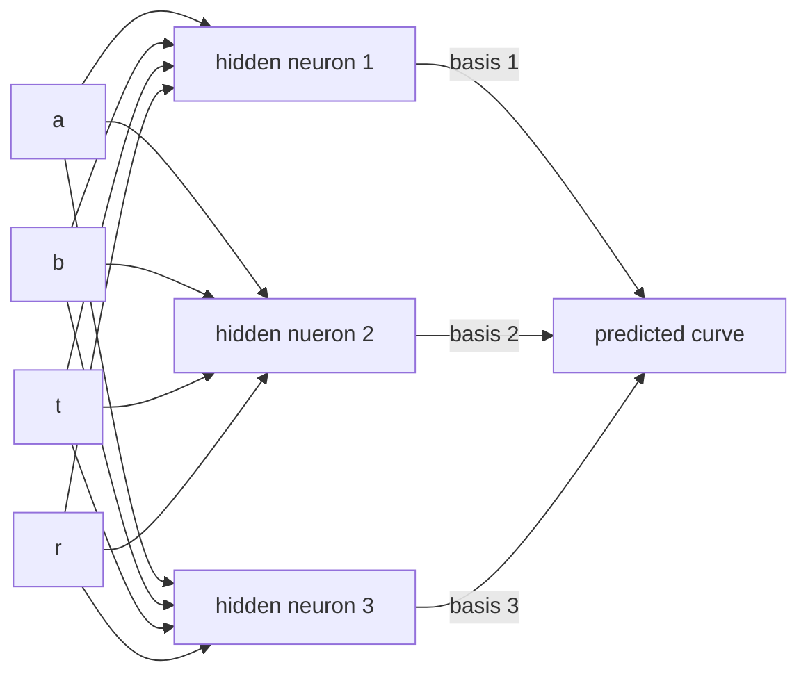
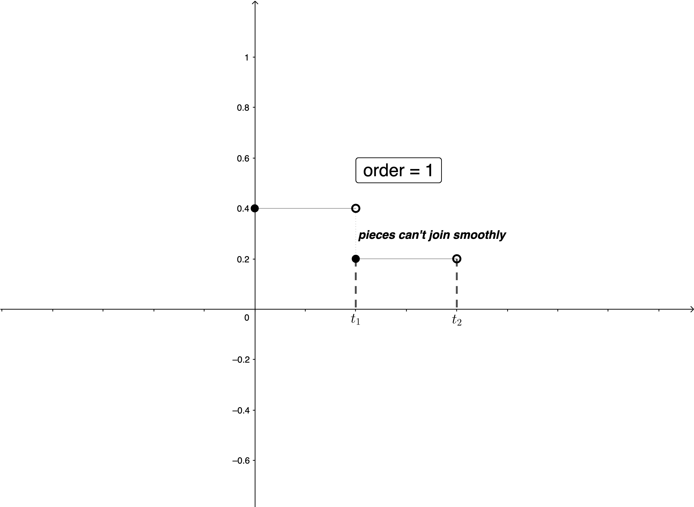
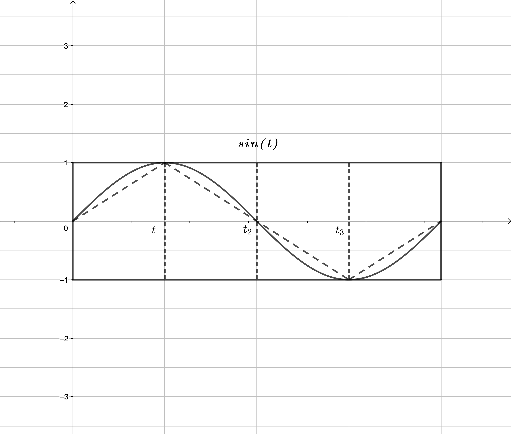
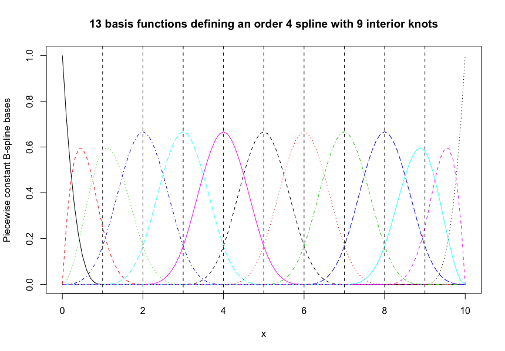

## :1st_place_medal: Model 1 procedure

#### :arrow_right: centroid method

* <b>If Centroid = 'mean'</b>

  > $$
  > \mathbf{\mu_{i} = \frac{1}{N_{i}}\sum_{X\in C_i}X}\\
  > \mathbf{g_{\mu_{i}}=\frac{1}{N_{i}}\sum_{X\in C_i}g_{X_i}}
  > $$

* <b>If Centroid = 'nearest neighbor'</b>

  > $$
  > \mathbf{\mu_{i} = argmin_{X}||X-\frac{1}{N_{i}}\sum_{X\in C_i}X||_2^2\text{ and }g_{\mu_i} \text{is the corresponding curve}}\\
  > \mathbf{g_{\mu_{i}} = argmin_{g_{X}}||g_{X}-\frac{1}{N_{i}}\sum_{X\in C_i}g_{X}||_2^2\text{ and }\mu_i\text{ is the corresponding feature}}
  > $$

#### :arrow_right: hidden neuron basis

* >$$
  >\mathbf{\Phi_j = \begin{bmatrix}g_{\mu_1}\cdot e^{-\gamma_1*\frac{||X_j-\mu_1||_2^2}{2}}&\cdots&g_{\mu_k}\cdot e^{-\gamma_k*\frac{||X_j-\mu_k||_2^2}{2  }}\end{bmatrix}}
  >$$
  >
  >

#### :arrow_right: weight calculation

* <b>After getting feature and curve centroid by training set</b>

  > $$
  > \mathbf{W = (\sum_{j=1}^{N_{total}}\Phi_j^T\Phi_j)^{-1}(\sum_{j=1}^{N_{total}}\Phi_j^Tg_j)}
  > $$
  >

#### :arrow_right: loss function

* <b>Then for any input feature</b>

  > $$
  > \textbf{input feature vector} = \mathbf{X_j}\\
  > \textbf{corresponding vector} = \mathbf{\Phi_j}\\
  > \mathbf{Loss_j} = \mathbf{\frac{1}{2}||g_j-\Phi_jW||_2^2}\\
  > \mathbf{=\frac{1}{2}(g_j-\Phi_jW)^T(g_j-\Phi_jW)}\\
  > \mathbf{=\frac{1}{2}g_j^Tg_j-W^T\Phi_j^Tg_j+\frac{1}{2}W^T\Phi_j^T\Phi_jW}
  > $$
  >

* <b>For N input features</b>

  > $$
  > \mathbf{Loss=\frac{1}{N}\sum_{j=1}^NLoss_j}\\
  > \mathbf{=\frac{1}{N}\sum_{j=1}^N(\frac{1}{2}g_j^Tg_j-W^T\Phi_j^Tg_j+\frac{1}{2}W^T\Phi_j^T\Phi_jW)}
  > $$

#### :arrow_right: Objective

* <b>Our goal is to find the optimized value of </b> $\mathbf{\Gamma=\begin{bmatrix}\gamma_1&\cdots&\gamma_k\end{bmatrix}}^T\in R^{k\times1}$ <b>and </b>$\mathbf{\mu=\begin{bmatrix}\mu_1&\cdots&\mu_k\end{bmatrix}\in R^{4\times k}}$ <b> so that to minimize the loss function</b>
* <b>The way to update</b> $\mathbf{\Gamma}$ <b>is to use backpropagation algorithm which is demonstrated as follows</b>

#### :arrow_down_small: Backpropagation procedure

* <b>Goal</b>

  > $$
  > \textbf{Find the optimized value of }\mathbf{G,\Gamma,\mu,\sigma^2}\textbf{ such that}\\
  > \mathbf{\frac{\partial Loss}{\partial G}=0_{m\times k}}\\
  > \mathbf{\frac{\partial Loss}{\partial \Gamma}=0_{k\times 1}}\\
  > \mathbf{\frac{\partial Loss}{\partial \mu}=0_{4\times k}}\\
  > $$
  
* <i><b>Step 1</b></i>

  > $$
  > \textbf{Let }\mathbf{a_j=\begin{bmatrix}a_{j1}&\cdots&a_{jk}\end{bmatrix}^T=\begin{bmatrix}\frac{-||(X_j-\mu_1)||_2^2}{2\sigma^2}&\cdots& \frac{-||(X_j-\mu_k)||_2^2}{2\sigma^2}\end{bmatrix}^T\in R^{k\times1}}\\
  > \textbf{Let }\mathbf{b_j=a_j\circ\Gamma=\begin{bmatrix}a_{j1}&\cdots&a_{jk}\end{bmatrix}^T\circ\begin{bmatrix}\gamma_1&\cdots\gamma_k\end{bmatrix}^T}\\
  > \mathbf{=\begin{bmatrix}\frac{-\gamma_1*||(X_j-\mu_1)||_2^2}{2\sigma^2}&\cdots& \frac{-\gamma_k*||(X_j-\mu_k)||_2^2}{2\sigma^2}\end{bmatrix}^T\in R^{k\times1}}\\
  > \mathbf{G=\begin{bmatrix}g_{\mu_1}&\cdots&g_{\mu_k}\end{bmatrix}\in R^{m\times k}}\\
  > \textbf{Let }\mathbf{\Phi_j=(1_{m\times1}\cdot exp(b_j)^T)\circ G}\\
  > \mathbf{=(1_{m\times1}\cdot exp(b_j)^T)\circ\begin{bmatrix}g_{\mu_1}&\cdots&g_{\mu_k}\end{bmatrix}\in R^{m\times k}}\\
  > $$
  
* <b><i>Step 2</i></b>

  > $$
  > \mathbf{\frac{\partial Loss}{\partial\Phi_j}=\frac{1}{N}(\Phi_jW-g_j)W^T\in R^{m\times k}}\\
  > \mathbf{\frac{\partial Loss}{\partial G}=\sum_{j=1}^N(\frac{\partial Loss}{\partial\Phi_j}\circ[1_{m\times1}\cdot exp(b_j)^T])\rightarrow(*)\in R^{m\times k}}\\
  > \mathbf{\frac{\partial Loss}{\partial b_j}=exp(b_j)_{k\times1}\circ[(\frac{\partial Loss}{\partial \Phi_j}\circ G)^T\cdot1_{m\times1}]\in R^{k\times1}}\\
  > \mathbf{\frac{\partial Loss}{\partial \Gamma}=\sum_{j=1}^N(\frac{\partial Loss}{\partial b_j}\circ a_j)\in R^{k\times1}\rightarrow(*)}\\
  > \mathbf{\frac{\partial Loss}{\partial a_j}=\frac{\partial Loss}{\partial b_j}\circ\Gamma\in R^{k\times1}}\\
  > \mathbf{\frac{\partial Loss}{\partial\mu_i}=\frac{1}{\sigma^2}\sum_{j=1}^N(\frac{\partial Loss}{\partial a_j})_i*(X_j-\mu_i)\in R^{4\times1}\rightarrow(*)}\\
  > \textbf{where }\mathbf{i=1,2,\cdots,k}\\
  > \mathbf{\frac{\partial Loss}{\partial\sigma^2}=-\frac{1}{\sigma^2}\sum_{j=1}^N(a_j^T\frac{\partial Loss}{\partial a_j})\rightarrow(*)}
  > $$

* <i><b>Step 3</b></i>

  > $$
  > \textbf{Globally update }\mathbf{\Gamma}\textbf{ by}\\
  > \mathbf{G=G-\alpha*\frac{\partial Loss}{\partial G}}\\
  > \mathbf{\Gamma=\Gamma-\alpha*\frac{\partial Loss}{\partial\Gamma}}\\
  > \mathbf{\mu_i=\mu_i-\alpha*\frac{\partial Loss}{\partial \mu_i}}\\
  > \mathbf{\sigma^2=\sigma^2-\alpha*\frac{\partial Loss}{\partial\sigma^2}}\\
  > \textbf{where }\mathbf{\alpha}\textbf{ is the learning rate}
  > $$

* <i><b>Step 4</b></i>

  > $$
  > \textbf{set iteration step }\mathbf{t}\textbf{ and threshold }\mathbf{\epsilon}\\\textbf{ such that algorithm finishes udpating procedure}\\
  > \textbf{if L reaches the threshold }\mathbf{\epsilon}\textbf{ or backpropagation iterates t times}
  > $$

## :arrow_lower_right: Derivation details

* <b>Objective</b>

  >$$
  >\mathbf{\frac{\partial Loss}{\partial G}、\frac{\partial Loss}{\partial\Gamma}、\frac{\partial Loss}{\partial\mu}、\frac{\partial Loss}{\partial\sigma^2}}
  >$$

* <b>First step</b>

  >$$
  >\mathbf{dLoss=\frac{1}{N}\sum_{j=1}^{N}d\{tr(\frac{1}{2}g_j^Tg_j-W^T\Phi_j^Tg_j)+\frac{1}{2}tr(W^T\Phi_j^T\Phi_jW)\}}\\
  >\mathbf{=\frac{1}{N}\sum_{j=1}^{N}\{\frac{1}{2}tr(W^T\Phi_j^Td\Phi_jW)+\frac{1}{2}tr(WW^T\Phi_j^Td\Phi_j)-tr(g_j^Td\Phi_jW)\}}\\
  >\mathbf{=\frac{1}{N}\sum_{j=1}^{N}\{\frac{1}{2}tr(WW^T\Phi_j^Td\Phi_j)+\frac{1}{2}tr(WW^T\Phi_j^Td\Phi_j)-tr(Wg_j^Td\Phi_j)\}}\\
  >\mathbf{=\frac{1}{N}\sum_{j=1}^{N}tr(W(W^T\Phi_j^T-g_j^T)d\Phi_j)}\\
  >\mathbf{=\sum_{j=1}^{N}tr(\frac{1}{N}W(W^T\Phi_j^T-g_j^T)d\Phi_j)}
  >$$

* <b>First conclusion</b>

  >$$
  >\mathbf{\Rightarrow \frac{\partial Loss}{\partial \Phi_j}=\frac{1}{N}(\Phi_jW-g_j)W^T\in R^{m\times k}\rightarrow(*)}
  >$$

* <b>Second step</b>

  >$$
  >\mathbf{d\Phi_j=d[1_{m\times1}exp^Tb_j]\circ G}\\
  >\mathbf{=G\circ[1_{m\times1}(exp^Tb_j\circ db_j^T)]+dG\circ[1_{m\times1}exp^Tb_j]}\\
  >\mathbf{dloss=\sum_{j=1}^{N}tr(\frac{\partial Loss}{\partial\Phi_j}^Td\Phi_j)}\\
  >\mathbf{=\sum_{j=1}^{N}tr(\frac{\partial Loss}{\partial\Phi_j}^T(G\circ[1_{m\times1}(exp^Tb_j\circ db_j^T)]))+\sum_{j=1}^{N}tr(\frac{\partial Loss}{\partial\Phi_j}^T[(1_{m\times1}exp^Tb_j)\circ dG])}\\
  >\mathbf{=(1)+(2)}\\
  >\mathbf{\frac{\partial Loss}{\partial\Phi_j}^T[G\circ[1_{m\times1}(exp^Tb_j\circ db_j^T)]]}\\
  >\mathbf{=(\frac{\partial Loss}{\Phi_j}\circ G)^T1_{m\times1}(exp^Tb_j\circ db_j^T)}\\
  >\mathbf{=([1_{m\times1}^T(\frac{\partial Loss}{\Phi_j}\circ G)]\circ exp^Tb_j)^Tdb_j^T}\\
  >\mathbf{=(expb_j\circ[(\frac{\partial Loss}{\Phi_j}\circ G)^T1_{m\times1}])db_j^T}\\
  >\mathbf{\Rightarrow(1)=\sum_{j=1}^{N}tr((expb_j\circ[(\frac{\partial Loss}{\Phi_j}\circ G)^T1_{m\times1}])db_j^T)}\\
  >\mathbf{=\sum_{j=1}^{N}tr((expb_j\circ[(\frac{\partial Loss}{\Phi_j}\circ G)^T1_{m\times1}])^Tdb_j)}\\
  >\mathbf{\Rightarrow(2)=\sum_{j=1}^{N}tr(\frac{\partial Loss}{\Phi_j}^T[(1_{m\times1}exp^Tb_j)\circ dG])}\\
  >\mathbf{=\sum_{j=1}^{N}tr([\frac{\partial Loss}{\Phi_j}\circ(1_{m\times1}exp^Tb_j)]^TdG)}\\
  >\mathbf{=tr(\sum_{j=1}^{N}[\frac{\partial Loss}{\Phi_j}\circ(1_{m\times1}exp^Tb_j)]^TdG)}
  >$$

* <b>Second conclusion</b>

  >$$
  >\mathbf{\frac{\partial Loss}{\partial b_j}=exp(b_j)\circ[(\frac{\partial Loss}{\Phi_j}\circ G)^T1_{m\times1}]\rightarrow(*)}\\
  >\mathbf{\frac{\partial Loss}{\partial G}=\sum_{j=1}^{N}[\frac{\partial Loss}{\Phi_j}\circ(1_{m\times1}exp^Tb_j)]\rightarrow(*)}
  >$$

* <b>Third step</b>

  >$$
  >\mathbf{\frac{\partial Loss}{\partial b_j}^Tdb_j=(\frac{\partial Loss}{\partial b_j})^Td(a_j\circ \Gamma)}\\
  >\mathbf{=(\frac{\partial Loss}{\partial b_j})^T(a_j\circ d\Gamma+da_j\circ \Gamma)}\\
  >\mathbf{=(\frac{\partial Loss}{\partial b_j}\circ a_j)^Td\Gamma+(\frac{\partial Loss}{\partial b_j}\circ\Gamma)^Tda_j}\\
  >\mathbf{\Rightarrow (1)=\sum_{j=1}^Ntr(\frac{\partial Loss}{\partial b_j}^Tdb_j)}\\
  >\mathbf{=\sum_{j=1}^N[tr((\frac{\partial Loss}{\partial b_j}\circ\Gamma)^Tda_j)+tr((\frac{\partial Loss}{\partial b_j}\circ a_j)^Td\Gamma)]}\\
  >\mathbf{=(3)+(4)}
  >$$

* <b>Third conclusion</b>

  >$$
  >\mathbf{\frac{\partial Loss}{\partial a_j}=\frac{\partial Loss}{\partial b_j}\circ\Gamma\rightarrow(*)}\\
  >\mathbf{\frac{\partial Loss}{\partial \Gamma}=\sum_{j=1}^N(\frac{\partial Loss}{\partial b_j}\circ a_j)\rightarrow(*)}
  >$$

* <b>Forth step</b>

  >$$
  >\mathbf{a_j=-\frac{1}{2\sigma^2}\begin{bmatrix}-||(X_j-\mu_1)||_2^2&\cdots& -||(X_j-\mu_k)||_2^2\end{bmatrix}^T}\\
  >\mathbf{da_j=\frac{-1}{2\sigma^2}d\begin{bmatrix}X_j^TX_j-2X_j^T\mu_1+\mu_1^T\mu_1\\\vdots\\X_j^TX_j-2X_j^T\mu_k+\mu_k^T\mu_k \end{bmatrix}+d(-\frac{1}{2\sigma^2})*(-2\sigma^2a_j)}\\
  >\mathbf{=}\\
  >\mathbf{=\frac{-1}{2\sigma^2}\begin{bmatrix}-2X_j^Td\mu_1+2\mu_1^Td\mu_1\\\vdots\\-2X_j^Td\mu_k+2\mu_k^Td\mu_k \end{bmatrix}-\frac{1}{\sigma^2}\frac{\partial Loss}{\partial a_j}^Ta_jd\sigma^2}\\
  >\mathbf{=\frac{1}{\sigma^2}\begin{bmatrix}(X_j-\mu_1)^Td\mu_1\\\vdots\\(X_j-\mu_k)^Td\mu_k \end{bmatrix}-\frac{1}{\sigma^2}\frac{\partial Loss}{\partial a_j}^Ta_jd\sigma^2}\\
  >\mathbf{\Rightarrow (3)= \sum_{j=1}^Ntr(\frac{\partial Loss}{\partial a_j}^Tda_j)}\\
  >\mathbf{=\sum_{i=1}^ktr(\sum_{j=1}^N\frac{1}{\sigma^2}(\frac{\partial Loss}{\partial a_j})_i*(X_j-\mu_i)^Td\mu_i)+\sum_{j=1}^Ntr(-\frac{1}{\sigma^2}\frac{\partial Loss}{\partial a_j}^Ta_jd\sigma^2)}\\
  >\mathbf{=(5)+(6)}\\
  >\mathbf{(6)=\sum_{j=1}^Ntr(-\frac{1}{\sigma^2}\frac{\partial Loss}{\partial a_j}^Ta_jd\sigma^2)}\\
  >\mathbf{=tr(\sum_{j=1}^N-\frac{1}{\sigma^2}\frac{\partial Loss}{\partial a_j}^Ta_jd\sigma^2)}\\
  >$$

* <b>Forth conclusion</b>

  >$$
  >\mathbf{\Rightarrow\frac{\partial Loss}{\partial\mu_i}=\frac{1}{\sigma^2}\sum_{j=1}^N(\frac{\partial Loss}{\partial a_j})_i*(X_j-\mu_i)\in R^{4\times1}\rightarrow(*)}\\
  >\mathbf{where\ i=1,2,\cdots,k}\\
  >\mathbf{\frac{\partial Loss}{\partial\sigma^2}=-\frac{1}{\sigma^2}\sum_{j=1}^N(a_j^T\frac{\partial Loss}{\partial a_j})\rightarrow(*)}
  >$$

## :2nd_place_medal:Model 2 Structure

## :thought_balloon:Notation

* >
  >$$
  >\textbf{neuron input: }\mathbf{X_j\in R^{4\times1},\ j=1,2,\cdots,N}
  >\\
  >\textbf{neuron output: }\mathbf{Z_j^{(3)}}
  >\\
  >\textbf{weight matrix: }\mathbf{W^{(1)},W^{(2)}}\\
  >\textbf{ground truth: }\mathbf{Y_j\in R^{m\times1}}
  >$$

## :arrow_right: ​Procedure

* <b><i>Step 1</i> </b>

  > $$
  > \textbf{Initialize weight matrix $\mathbf{W^{(1)}_{k\times 4}}$ to connect input layer and hidden layer}
  > \\
  > \textbf{Set up loss function threshold and maximum iteration steps during training}
  > $$

* <b><i>Step 2</i></b>

  > $$
  > \textbf{Select basis for each hidden neuron from 1 to k }\\
  > \mathbf{\Phi=\begin{bmatrix}\phi_1&\phi_2&\cdots&\phi_k\end{bmatrix}}
  > $$

* <b><i>Step 3</i></b>

  > $$
  > \textbf{For observation j }\\
  > \textbf{multiply input by weight matrix to get}\\
  > \mathbf{Z_j^{(2)}=W^{(1)}\cdot X_j\in R^{k\times1}}
  > $$

* <b><i>Step 4</i></b>

  >$$
  >\mathbf{a_j^{(2)}=exp(W^{(1)}X_j)\in R^{k\times1}}
  >$$
  
* <b><i>Step 5</i></b>

  > $$
  > \textbf{modify the scale of selected basis to get}\\
  > \mathbf{b_j^{(2)}=(1_{m\times1}a_j^{(2)^T})\circ\Phi}\\
  > \mathbf{=\begin{bmatrix}\mathbf{a_{j1}^{(2)}}*\phi_1&\cdots&\mathbf{a_{jk}^{(2)}}*\phi_k\end{bmatrix}_{m\times k}\in R^{m\times k}}
  > $$
  
* <b><i>Step 6</i></b>

  >$$
  >\mathbf{Z_j^{(3)}=b_j^{(2)}W^{(2)}\in R^{m\times1}}
  >$$
  
* <b><i>Step 7</i></b>

  > $$
  > \textbf{For N training samples }\mathbf{\{<X^{(1)}_{1},Y_{1}>,\cdots,<X^{(1)}_{N},Y_{N}>\}}
  > \\
  > \mathbf{W^{(2)}=(\sum_{j=1}^Nb^{(2)^T}_{j}b_{j}^{(2)})^{-1}(\sum_{j=1}^Nb_{j}^{(2)^T}Y_{j})\in R^{k\times1}}
  > $$

* <b><i>Step 8</i></b>

  > $$
  > \textbf{Loss function }\mathbf{L=\frac{1}{N}\sum_{j=1}^{N}\frac{1}{2}||b_j^{(2)}W^{(2)}-Y_j||_2^2}\\
  > \mathbf{=\frac{1}{N}\sum_{j=1}^{N}\{tr(\frac{1}{2}W^{(2)^T}b_j^{(2)^T}b_j^{(2)}W^{(2)})-tr(Y_j^Tb_j^{(2)}W^{(2)})+tr(\frac{1}{2}Y_j^TY_j)\}}
  > $$

* <b><i>Step 9</i></b>

  > $$
  > \mathbf{\frac{\partial Loss}{b_j^{(2)}}=\frac{1}{N}(b_j^{(2)}W^{(2)}-Y_j)W^{(2)^T}\in R^{m\times k}}\\
  > \mathbf{\frac{\partial Loss}{\partial a_j^{(2)}}=(\frac{\partial Loss}{\partial b_j^{(2)}}\circ\Phi)^T\cdot1_{m\times1}\in R^{k\times1}}\\
  > \mathbf{\frac{\partial Loss}{\partial \Phi}=\sum_{j=1}^{N}\frac{\partial Loss}{\partial b_j^{(2)}}\circ (1_{m\times1}a_j^{(2)^T})\in R^{m\times k}}\\
  > \mathbf{\frac{\partial Loss}{\partial W^{(1)}} = \sum_{j=1}^N[\frac{\partial Loss}{\partial a_j^{(2)}}\circ exp(W^{(1)}X_j)]X_j^T\in R^{k\times4}}
  > $$
  
* <i><b>Step 10</b></i>

  > $$
  > \mathbf{W^{(1)}=W^{(1)}-\alpha*\frac{\partial Loss}{\partial W^{(1)}}}\\
  > \mathbf{\Phi=\Phi-\alpha*\frac{\partial Loss}{\partial\Phi}}
  > $$
  
* <b><i>Step 11</i></b>

  > $$
  > \textbf{Use updated }\mathbf{W^{(1)}、\Phi}\textbf{ to execute from step 3 again}\\
  > \textbf{set iteration step }\mathbf{t}\textbf{ and threshold }\mathbf{\epsilon}\\\textbf{ such that algorithm finishes udpating procedure}\\
  > \textbf{if Loss reaches the threshold }\mathbf{\epsilon}\textbf{ or backpropagation iterates t times}
  > $$

## :arrow_down: ​Derivation details

* <b><i>Derivation of </i></b>$\mathbf{W^{(2)}}$

  > $$
  > \mathbf{Loss = \frac{1}{N}\sum_{i=1}^{N}\frac{1}{2}(b^{(2)}_jW^{(2)}-Y_{j})^T(b^{(2)}_jW^{(2)}-Y_{j})}\\
  > \mathbf{=\frac{1}{N}\sum_{j=1}^{N}\frac{1}{2}(W^{(2)^T}b_{j}^{(2)^T}b_{j}W^{(2)}-2Y_{j}^Tb_{j}^{(2)}W^{(2)}+Y_{j}^TY_{j})}\\
  > \mathbf{\Rightarrow\frac{\partial L}{\partial W^{(2)}}=\frac{1}{N}\sum_{j=1}^{N}(W^{(2)^T}b^{(2)^T}_{j}b^{(2)}_{j}-Y_{j}^Tb^{(2)}_{j})=0}\\
  > \mathbf{\Rightarrow\sum_{j=1}^{N}b^{(2)^T}_{j}b^{(2)}_{j}W^{(2)}=\sum_{j=1}^{N}b_{j}^{(2)^T}Y_{j}}\\
  > \mathbf{\Rightarrow W^{(2)}=(\sum_{j=1}^{N}b^{(2)^T}_{j}b^{(2)}_{j})^{-1}(\sum_{j=1}^{N}b_{j}^{(2)^T}Y_{j})
  > }
  > $$

* <i><b>Partial derivative of </b></i>$\mathbf{b_j^{(2)}}$

  >$$
  >\mathbf{dLoss = \frac{1}{N}\sum_{j=1}^Ntr(W^{(2)^T}b_j^{(2)^T}db_j^{(2)}W^{(2)}-W^{(2)}db_j^{(2)}Y_j)}\\
  >\mathbf{=\sum_{j=1}^Ntr(\frac{1}{N}W^{(2)}(W^{(2)^T}b_j^{(2)^T}-Y_j^T)db_j^{(2)})}\\
  >\mathbf{\frac{\partial Loss}{\partial b_j^{(2)}}=\frac{1}{N}(b_j^{(2)}W^{(2)}-Y_j)W^{(2)^T}\rightarrow(*)}
  >$$

* <b><i>Partial derivative of </i></b>$\mathbf{a_j^{(2)}}$

  >$$
  >\mathbf{dLoss=\sum_{j=1}^Ntr(\frac{\partial L}{\partial b_j^{(2)}}^Tdb_j^{(2)})}\\
  >\mathbf{db_j^{(2)}=d(1_{m\times1}a_j^{(2)^T})\circ\Phi+(1_{m\times1}a_j^{(2)^T})\circ d\Phi}\\
  >\mathbf{(1_{m\times1}da_j^{(2)^T})\circ d\Phi+(1_{m\times1}a_j^{(2)^T})\circ d\Phi}\\
  >\mathbf{dLoss = \sum_{j=1}^Ntr(\frac{\partial Loss}{\partial b_j^{(2)}}^T[(1_{m\times1}da_j^{(2)^T})\circ\Phi])+\sum_{j=1}^Ntr(\frac{\partial Loss}{\partial b_j^{(2)}}^T[(1_{m\times1}a_j^{(2)^T})\circ d\Phi])}\\
  >\mathbf{=(1)+(2)}\\
  >\mathbf{\Rightarrow (1)=\sum_{j=1}^Ntr[(\frac{\partial Loss}{\partial b_j^{(2)}}\circ\Phi)^T1_{m\times1}da_j^{(2)^T}]}\\
  >\mathbf{=\sum_{j=1}^Ntr(da_j^{(2)}1_{m\times1}^T(\frac{\partial Loss}{\partial b_j^{(2)}}^T\circ \Phi))}\\
  >\mathbf{=\sum_{j=1}^Ntr(1_{m\times1}^T(\frac{\partial Loss}{\partial b_j^{(2)}}\circ \Phi)da_j^{(2)})}\\
  >\mathbf{\Rightarrow \frac{\partial Loss}{\partial a_j^{(2)}}=(\frac{\partial Loss}{\partial b_j^{(2)}}\circ\Phi)^T1_{m\times1}\rightarrow(*)}\\
  >\mathbf{\Rightarrow (2)=\sum_{j=1}^Ntr(\frac{\partial Loss}{\partial b_j^{(2)}}^T[(1_{m\times1}a_j^{(2)^T})\circ d\Phi])}\\
  >\mathbf{=\sum_{j=1}^Ntr([\frac{\partial Loss}{\partial b_j^{(2)}}\circ(1_{m\times1}a_j^{(2)^T})]^T d\Phi)}\\
  >\mathbf{=tr(\sum_{j=1}^N[\frac{\partial Loss}{\partial b_j^{(2)}}\circ(1_{m\times1}a_j^{(2)^T})]^T d\Phi)}\\
  >\mathbf{\Rightarrow \frac{\partial Loss}{\partial \Phi}=\sum_{j=1}^N[\frac{\partial Loss}{\partial b_j^{(2)}}\circ(1_{m\times1}a_j^{(2)^T})]\rightarrow(*)}\\
  >$$

* <i><b>Partial derivative of </b></i>$\mathbf{W^{(1)}}$

  >$$
  >\mathbf{dLoss=(1)+(2)}\\
  >\mathbf{=\sum_{j=1}^Ntr(\frac{\partial Loss}{\partial a_j^{(2)}}^Tda_j^{(2)})+tr(\frac{\partial Loss}{\partial \Phi}^Td\Phi)}\\
  >\mathbf{da_j^{(2)}=dexp(W^{(1)}X_j)=exp(W^{(1)}X_j)\circ(dW^{(1)}X_j)}\\
  >\mathbf{(1)=\sum_{j=1}^Ntr(\frac{\partial Loss}{\partial a_j^{(2)}}^Tda_j^{(2)})}\\
  >\mathbf{=\sum_{j=1}^Ntr(\frac{\partial Loss}{\partial a_j^{(2)}}^T[exp(W^{(1)}X_j)\circ(dW^{(1)}X_j)])}\\
  >\mathbf{=\sum_{j=1}^Ntr([\frac{\partial Loss}{\partial a_j^{(2)}}\circ exp(W^{(1)}X_j)]^TdW^{(1)}X_j)}\\
  >\mathbf{=\sum_{j=1}^Ntr(X_j[\frac{\partial Loss}{\partial a_j^{(2)}}\circ exp(W^{(1)}X_j)]^TdW^{(1)})}\\
  >\mathbf{=tr(\sum_{j=1}^NX_j[\frac{\partial Loss}{\partial a_j^{(2)}}\circ exp(W^{(1)}X_j)]^TdW^{(1)})}\\
  >\mathbf{\Rightarrow \frac{\partial Loss}{\partial W^{(1)}}=\sum_{j=1}^N[\frac{\partial Loss}{\partial a_j^{(2)}}\circ exp(W^{(1)}X_j)]X_j^T\rightarrow(*)}
  >$$

# :eagle: B-Spline basis for spline functions

#### Spline function characteristic

* <b>order</b>
  
  * <b>number of constants needed to define the polynomial function</b>
* <b>degree</b>
  
  * <b>the highest power in the polynomial</b>
* <b>example</b>
  * $\mathbf{y = a+b*t}$  <b>is a function of order 2 and degree 1 while t is a predictor variable and a、b  are constant coefficients</b>
  * $\mathbf{a+b*t+c*t^2}$ <b>is a function of order 3 and degree 2</b>
* <b>breakpoint</b>
  
  * <b>unique knot values</b>
* <b>knot</b>
  * <b>the sequence of values at breakpoints</b>
  * <b>one breakpoint may contain multiple knot </b>

* <b>Adjacent polynomials need to join up smoothly at the knots/breakpoints when</b> $\textbf{order>1}$

* <b>if order = 1, situation becomes as below</b>
  

* <b>m orders polynomials means (m-2)'s order derivative continuous</b>
  * <b>m order function</b> $\mathbf{f=a_1+a_2*t+\cdots+a_{m}*t^{m-1}}$
  * <b>first order</b> $\mathbf{=D^{(1)}f=a_2+\cdots+(m-1)a_m*t^{m-2}}$
  * <b>(m-2)'s order</b>$\mathbf{=D^{(m-2)}f=(m-1)!*t}$
  * <b>(m-2)'s order function is continous</b>

* <b>degree of freedom</b>

  * <b>Spline function has following features</b>

    * <b>function values of adjacent polynomials join smoothly at the knots when order > 1</b>
    * <b>derivatives up to (m-2)'s order join smoothly at the knots for adjacent polynomials </b>

  * <b>Based on the features of Spline, the degree of freedom is</b>

    > $$
    > \mathbf{df=m+L-1}\\
    > \textbf{where m is the order and L-1 is the number of interior knots}\\
    > \textbf{for the situation with 1 knot per breakpoint}
    > $$

  * <b>derivation</b>

    > $$
    > \textbf{For the knot sequence being: }\mathbf{\{t_0,\cdots,t_{L-1},t_L\}}\\
    > \textbf{expression for an arbitrary m order polynomial is:}\\
    > \mathbf{f = a_1+a_2*t+\cdots+a_m*t^{m-1}}\\
    > \textbf{for L intervals there are mL parameters needed to be defined}\\
    > \textbf{for L-1 interior knots where each knot contains m-1 coincident pairs}\\
    > \mathbf{\{f,D^{(1)}f,\cdots,D^{(m-2)}f\}}\\
    > \textbf{there are (m-1)(L-1) constraints}\\
    > \textbf{thus the degree of freedom is:}\\
    > \mathbf{mL-(m-1)(L-1) = m+L-1}
    > $$

$$
\mathbf{f=a_1+a_2*t}\\
\textbf{function values join smoothly at the knots}\\
\mathbf{df=4\times2-1\times3=5}
$$

* <b>For k B-spline basis function</b>
  $$
  \mathbf{\{\Phi_1,\cdots,\Phi_k\}}\\
  \textbf{Each }\mathbf{\Phi_i(t)}\textbf{ has no more than m intervals that are nonzero}\\
  \textbf{B-spline has the compact support property}\\
  \textbf{k order matrix of inner product}\\
  \mathbf{\begin{bmatrix}\Phi_1'\Phi_1&\cdots&\Phi_1'\Phi_k\\\vdots& \ddots& \vdots\\\Phi_k'\Phi_1& \cdots& \Phi_k'\Phi_k\end{bmatrix}}\\
  \textbf{has no more than (m-1) sub-diagonals above and below the main diagonals}\\
  \textbf{which contain nonzero values}
  $$

* :fist_oncoming: ​<b>example</b>

$$
\textbf{From the example, we see that each B-spline polynomial function}\\
\textbf{have no more than (m-1) intersection}\\
\textbf{with the latter functions as well as the former functions}
$$

